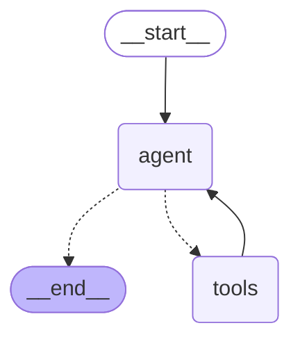

# Smart Event Planner Assistant

The **Smart Event Planner Assistant** is an AI-powered agent designed to help users find event venues through natural conversation. It allows users to query for venues based on criteria like location, capacity, amenities, and price.

The system leverages:
- **LangChain ReAct Agent**: Using the ReAct (Reasoning + Acting) pattern for natural language understanding and tool execution.
- **MongoDB**: For storing and retrieving venue data.
- **OpenRouter API**: To access powerful LLMs (e.g., GPT-4o-mini) for natural language understanding and generation.

## Recent Optimizations

The agent architecture was recently migrated from LangGraph's state machine to LangChain's ReAct agent pattern, resulting in:

**Benefits:**
- Reduction in code complexity
- Simplified maintenance and debugging
- Built-in error handling and iteration limits
- Standard LangChain patterns for better ecosystem compatibility

**Trade-offs:**
- ReAct agents can sometimes get stuck in infinite loops if the prompt format is not clear or if the LLM doesn't properly follow the Thought/Action/Observation sequence
- Memory only persists during runtime (no disk persistence)
- Linear conversation flow only (no branching logic)

## Features

- **Conversational Interface**: Interact with the agent naturally via a CLI.
- **Venue Search**: Find venues by location, capacity, and amenities.
- **Context Awareness**: The agent remembers conversation context (e.g., "What amenities does it have?" refers to the previously discussed venue).
- **Tool Integration**: Automatically calls database tools to fetch real-time data.



## Prerequisites

- **Python 3.8+**
- **MongoDB**: You need a running instance of MongoDB (Community Edition recommended).
    - [Download MongoDB Community Server](https://www.mongodb.com/try/download/community)

## Installation

1.  **Clone the repository** (if applicable) or navigate to the project directory.

2.  **Create a virtual environment** (recommended):
    ```bash
    python -m venv venv
    source venv/bin/activate  # On Windows: venv\Scripts\activate
    ```

3.  **Install dependencies**:
    ```bash
    pip install -r requirements.txt
    ```

4.  **Configure Environment Variables**:
    - Copy `.env.example` to `.env`:
        ```bash
        cp .env.example .env  # On Windows: copy .env.example .env
        ```
    - Open `.env` and fill in your details:
        - `OPENROUTER_API_KEY`: Your OpenRouter API key.
        - `MONGO_URI`: Your MongoDB connection string (default: `mongodb://localhost:27017`).
        - `OPENROUTER_MODEL`: Model name (default: `openai/gpt-4o-mini`).

## Setup & Running

1.  **Start MongoDB**:
    - Ensure your MongoDB service is running. On Windows, this is usually a background service. You can verify it using `mongosh` or MongoDB Compass.

2.  **Seed the Database**:
    - Populate local MongoDB with test data (venues in Boston, New York, etc.):
        ```bash
        python seed.py
        ```

3.  **Run the Agent**:
    - Start the interactive CLI:
        ```bash
        python main.py
        ```
    - Type `quit` or `exit` to end the session.

## Example Usage

Once you run `python main.py`, you can interact with the agent like this:

```
You: I need a venue in Boston for 150 people
Agent: I found several venues in Boston that can accommodate 150 people. Here are some options:
       - Grand Ballroom: Capacity 200, $5000/day, Amenities: WiFi, Projector, Catering
       - Tech Conference Center: Capacity 180, $3500/day, Amenities: WiFi, Projector, Parking
       Would you like more details about any of these venues?

You: What amenities does the first one have?
Agent: The Grand Ballroom has the following amenities:
       - WiFi
       - Projector
       - Catering

You: Show me venues with parking
Agent: Here are the venues with parking available:
       - Tech Conference Center: Capacity 180, $3500/day
       - Downtown Meeting Hall: Capacity 100, $2000/day
```

The agent understands context and can answer follow-up questions about previously mentioned venues.

## Testing

To run the unit tests:

```bash
python -m pytest
```