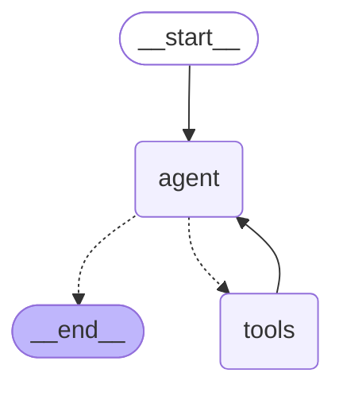

# Part 3 Implementation Report

## Summary
Successfully implemented the state definition and graph construction for the Smart Event Planner agent using LangGraph.

## Required Changes
- Created `agent.py` which contains:
    - **State Definition**: Defined `AgentState` using `TypedDict` to tracking the sequence of messages in the conversation.
    - **Graph Construction**: Built a `StateGraph` with:
        - `agent` node: Calls the LLM bound with tools.
        - `tools` node: Executes tool calls appearing in messages.
        - Conditional edges: Routes from `agent` to `tools` if tool calls are present, otherwise to `END`.
        - Normal edge: Routes from `tools` back to `agent`.
    - **Compilation**: Exposed `get_agent_graph()` to retrieve the compiled `Runnable`.

### Graph Visualization

## Testing Service
- Created `tests/test_agent.py`.
- Verified:
    - Graph compilation.
    - Agent node execution without tools (direct response).
    - Agent node execution with tools (mocked LLM and DB).
- All tests passed.

## Next Steps
Proceed to Part 4:
- Build the interface in `main.py` to run the agent loop.
- Perform end-to-end testing with real or simulated user input.
